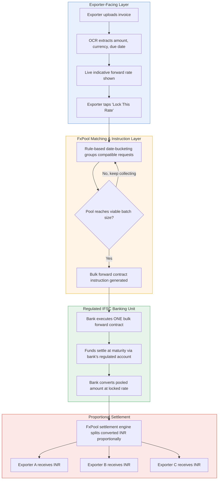

# FxPool — Instant Forex Hedging for Small Exporters

**GIFT IFIH Young Builders' Program — FinTech Ideation Hackathon 2026**
Track: FinTech Innovation · Focus Area: Treasury & Investment Intelligence · Stage: Research

📄 [Research Proposal (PDF)](./FxPool_Research_Proposal.pdf)
🎮 [Live Prototype - Pack the Pool](#) *(https://fxpool-prototype.vercel.app/)*

---

## The Problem

Small exporters ship goods before payment arrives, with settlement 30–90
days later. In that window, INR/USD can swing 3–5% — often more than
their entire margin on the order.

Forex hedging (locking today's rate for a future date) fixes this, but
banks can't profitably offer it below ~$50,000 per deal. The paperwork,
KYC, and compliance checks cost a bank roughly the same whether the
ticket is $2,000 or $2,000,000 — so small exporters get priced out
entirely.

**Result:** only ~35% of India's MSME exporters currently hedge. The
rest absorb currency risk they never chose to take, on every single
order.

## The Solution

FxPool pools many small exporters' similar-currency, similar-timing
hedge requests into a single bulk forward contract, executed through a
GIFT City IFSC banking unit. The pooled deal is large enough for the
bank to serve profitably; each exporter still gets their own
individually locked rate back, proportionally, at settlement.

FxPool never takes custody of client funds — it's purely a matching and
instruction layer on top of regulated IFSC infrastructure.

## Architecture

**Key design principle:** FxPool never sits in the money's path. Funds
always flow between exporters and the regulated IFSC banking unit —
FxPool only matches, instructs, and reconciles.

## MVP Scope (Hackathon Build)

| Layer | What we're building | What's simulated/future |
|---|---|---|
| Invoice entry | Functional form + rate display | OCR auto-extraction (mocked with sample data) |
| Pooling logic | Working date-bucketing + batch visualization | Real-time multi-user pool matching at scale |
| Rate lock | Live-looking forward rate calculation | Actual bank API integration |
| Settlement | Proportional split-back demo with sample numbers | Live IFSC banking unit settlement |

## Tech Stack (Not Fixed)

- **Frontend:** React
- **Rate logic:** Interest-rate-differential forward pricing (standard formula)
- **Pooling engine:** Rule-based date-bucket grouping
- **Backend/data:** Mocked pool + settlement state for demo purposes

## Regulatory Positioning

FxPool is designed as a technology layer on top of a licensed IFSC
banking unit, which holds the forex dealer license and executes the
actual forward contract. This keeps FxPool's role scoped to matching,
instruction, and reconciliation — a realistic, low-friction candidate
for the IFSCA FinTech Sandbox rather than a new licensing category.

## What's in this repo

- [`FxPool_Research_Proposal.pdf`](./FxPool_Research_Proposal.pdf) — full
  research proposal: problem research, pooling mechanism with a worked
  example, tech architecture, regulatory positioning, and validation plan.
- Link to **Pack the Pool**, a playable prototype of the pooling
  mechanism (source lives in its own repo/folder alongside this one).

## Team & Links

- **Research Proposal:** `FxPool_Research_Proposal.pdf`
- **Hackathon:** GIFT IFIH Young Builders' Program 2026, GIFT City,
  Ahmedabad — 21–22 August 2026